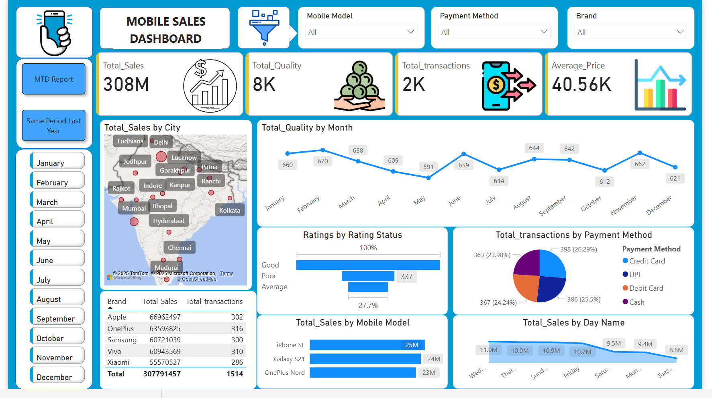
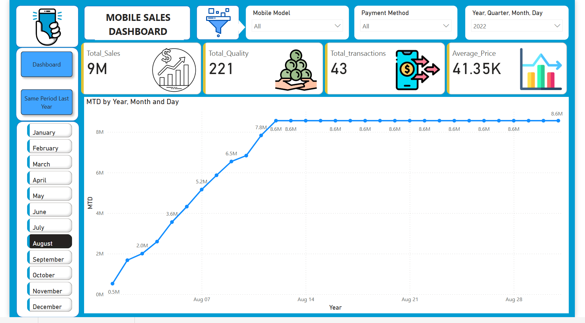
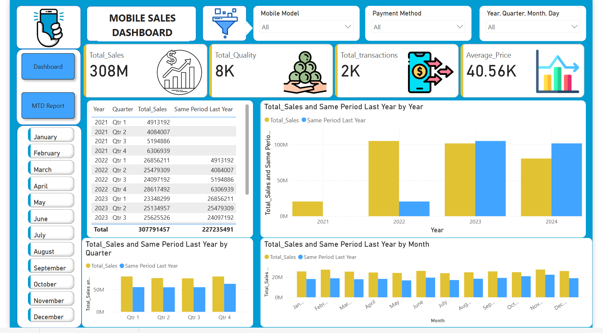

# POWER-BI-Dashboard_2
# Mobile Sales Dashboard Power BI Project

# 📊 Mobile Sales Dashboard | Power BI Project

## 📁 Project Overview

This Power BI project presents an interactive dashboard to analyze mobile phone sales across multiple cities in India. The dataset includes various dimensions like brands, models, cities,

payment methods, ratings, and time (year, quarter, month, day). 

This end-to-end BI project demonstrates real-world data handling — from importing and cleaning raw data, transforming it using Power Query, modeling relationships, creating a custom date table,

applying DAX measures, and finally designing a rich dashboard for actionable insights.

---

## 🧠 Key Objectives

- Import, clean, and transform raw sales data using Power Query
- 
- Create a custom calendar table for dynamic date-based filtering
- 
- Establish model relationships for accurate aggregations
- 
- Build a professional and interactive Power BI dashboard
- 
- Explore and apply DAX formulas for KPIs and time intelligence

---

## 📷 Dashboard Preview

## 🧩 Project Steps

1. **Data Understanding**  
   Explored the raw sales data which includes metrics such as:
   - Sales Amount
   - Quantity Sold
   - Payment Methods
   - Mobile Brands and Models
   - Transaction Dates
   - Ratings

2. **Import Data**  
   - Imported multiple Excel/CSV datasets into Power BI.

3. **Power Query for Data Cleaning**  
   - Removed nulls, unnecessary columns
   - Corrected data types
   - Standardized column names

4. **Data Transformation**  
   - Split/merged columns
   - Converted formats (e.g., dates, prices)
   - Added conditional columns for logic-based transformations

5. **Created a Custom Calendar Table**  
   - Used `CALENDARAUTO()` and `ADDCOLUMNS()` in DAX
   - Included Year, Quarter, Month, Day, Weekday

6. **Data Modeling**  
   - Established one-to-many relationships between fact and dimension tables
   - Verified cardinality and ensured referential integrity

7. **Explored DAX Formulas**  
   - `TOTALYTD()`, `CALCULATE()`, `PREVIOUSYEAR()`
   - Custom KPIs like:
     - Total Sales
     - Average Price
     - Total Transactions
     - MTD, YTD, QoQ metrics

8. **Dashboard Development**  
   Designed a clean and dynamic dashboard with:
   - Total Sales, Transactions, and Average Price KPIs
   - Slicers for Year, Month, Brand, Payment Method, Mobile Model
   - Visuals:
     - Sales by City (Map)
     - Transactions by Payment Method (Pie Chart)
     - Sales by Mobile Model (Bar Chart)
     - Ratings Distribution
     - Time-based Sales Analysis (Line Charts)
     - Quarter-over-quarter and YoY Comparison Charts

---

## 📊 Tools & Technologies

- Power BI Desktop
- Power Query Editor
- DAX (Data Analysis Expressions)
- Excel/CSV

---

